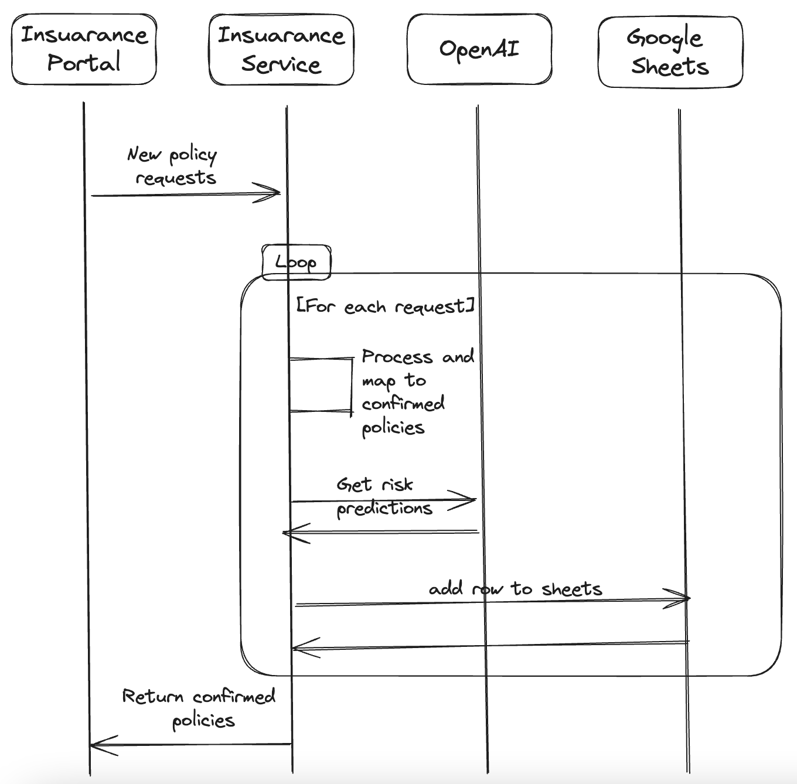
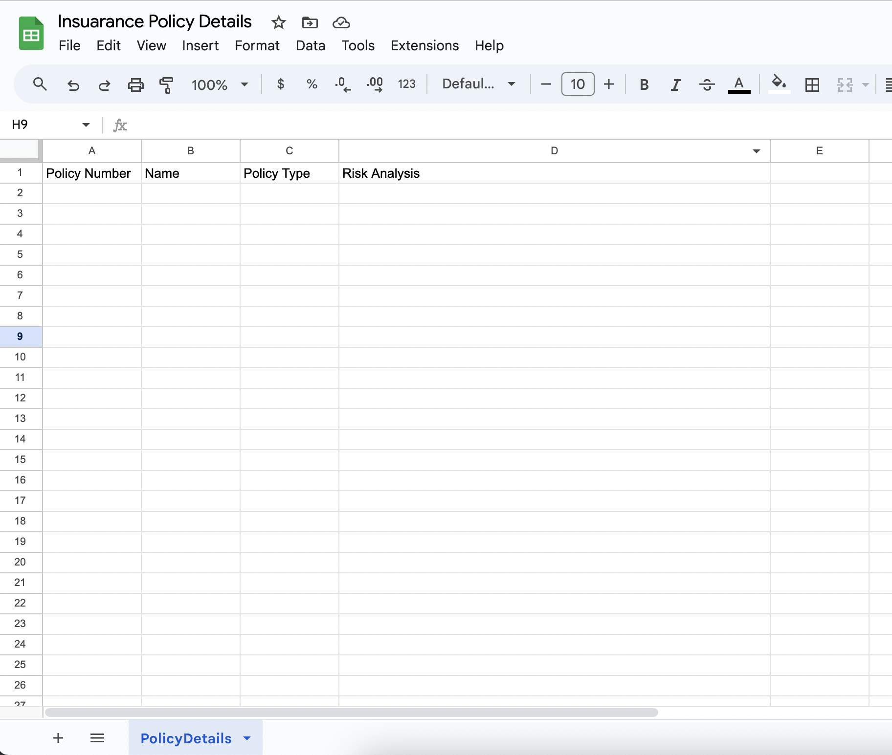
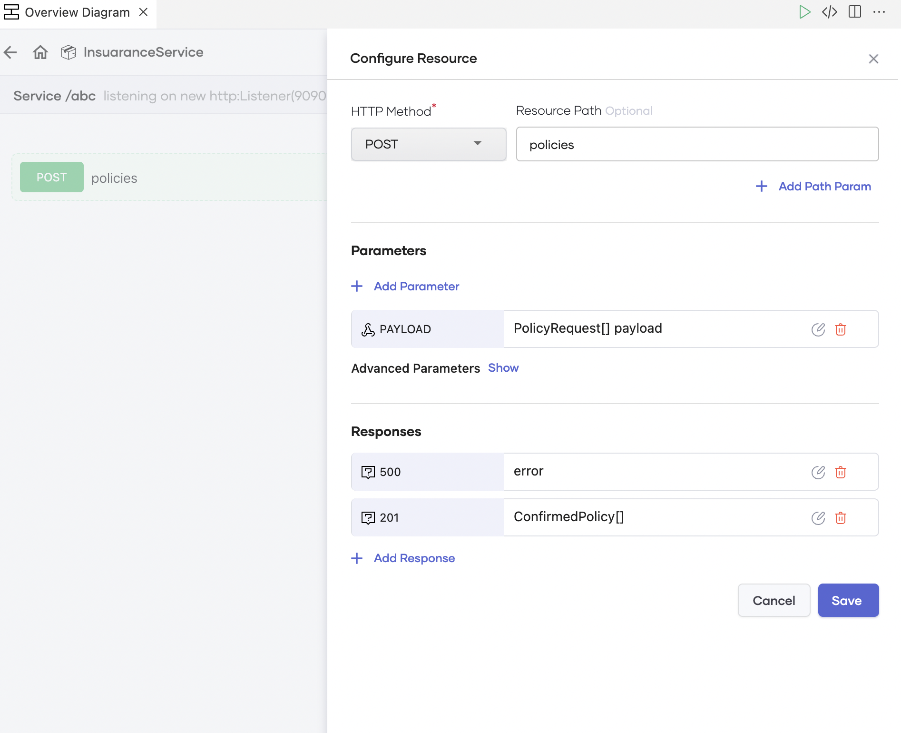
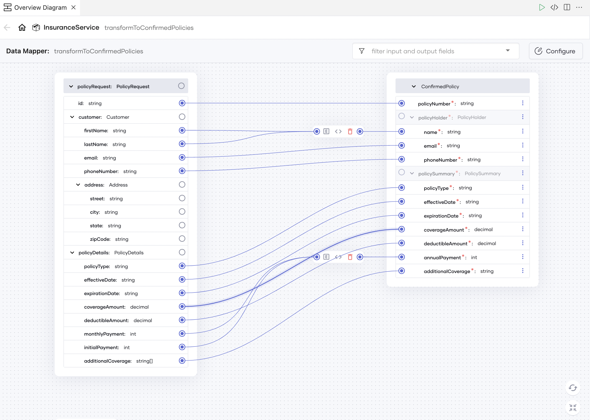
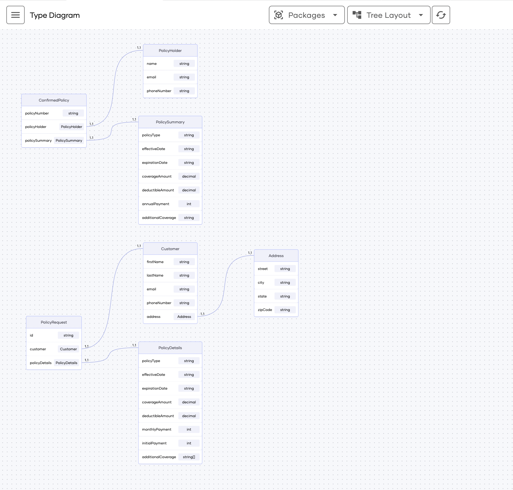
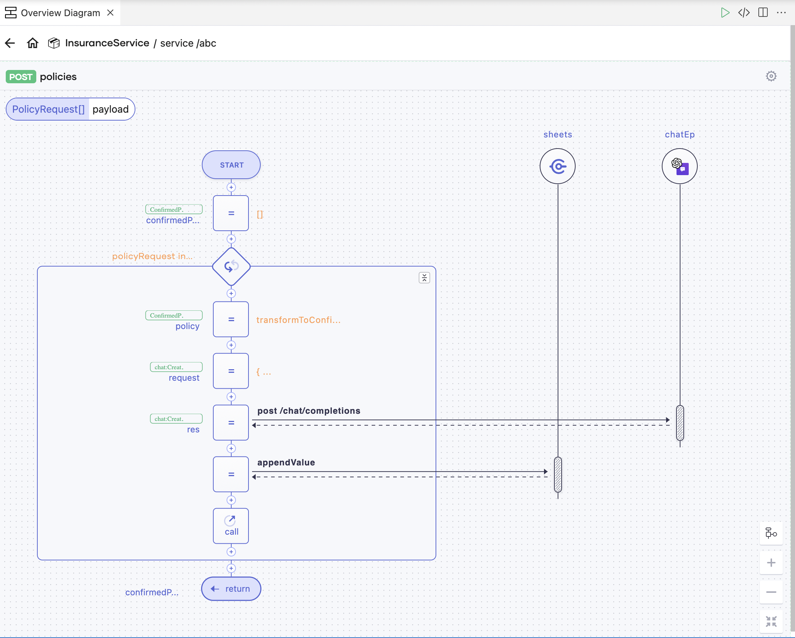

# Ballerina HTTP service for insurance data backend

This Ballerina-based HTTP service serves as the backend for an insurance service provider. It processes a JSON array containing new insurance policy details and performs the following tasks upon receipt:

1. Computes and transforms the input payload into the necessary output payload.
2. Utilizes OpenAI for risk analysis of the provided policy.
3. Updates a Google Sheet with the Policy Number, Name, Insurance Type, and Risk Analysis.



## Prerequisites

1. Download and install [Ballerina Swan Lake](https://ballerina.io/downloads/)
2. Visual Studio Code with the [Ballerina extension](https://wso2.com/ballerina/vscode/docs/) installed.
3. Create a Google Account and obtain the tokens by following the blog.[Using OAuth 2.0 to access Google APIs](https://medium.com/@anupama.pathirage/using-oauth-2-0-to-access-google-apis-1dbd01edea9a)
4. Create an [OpenAI account](https://platform.openai.com/signup/) and bbtain an API key by following [these instructions](https://platform.openai.com/docs/api-reference/authentication).


## Input JSON structure

```json
{
    "id": "AI123456789",
    "customer": {
        "firstName": "Alice",
        "lastName": "Johnson",
        "email": "alice.johnson@example.com",
        "phoneNumber": "+1 (123) 456-7890",
        "address": {
            "street": "123 Main St",
            "city": "Anytown",
            "state": "CA",
            "zipCode": "12345"
        }
    },
    "policyDetails": {
        "policyType": "Auto Insurance",
        "effectiveDate": "2023-10-01",
        "expirationDate": "2024-10-01",
        "coverageAmount": 500000.00,
        "deductibleAmount": 1000.00,
        "monthlyPayment": 150,
        "initialPayment": 500,
        "additionalCoverage": [
            "Rental Car Reimbursement",
            "Roadside Assistance"
        ]
    }
}
```

### Output JSON structure

```json
{
    "policyNumber": "AI123456789",
    "policyHolder": {
        "name": "Alice Johnson",
        "email": "alice.johnson@example.com",
        "phoneNumber": "+1 (123) 456-7890"
    },
    "policySummary": {
        "policyType": "Auto Insurance",
        "effectiveDate": "2023-10-01",
        "expirationDate": "2024-10-01",
        "coverageAmount": 500000.00,
        "deductibleAmount": 1000.00,
        "annualPayment": 2300,
        "additionalCoverage": "Rental Car Reimbursement,Roadside Assistance"
    }
}
```

## Sample Input

```json
[
    {
        "id": "AI123456789",
        "customer": {
            "firstName": "Alice",
            "lastName": "Johnson",
            "email": "alice.johnson@example.com",
            "phoneNumber": "+1 (123) 456-7890",
            "address": {
                "street": "123 Main St",
                "city": "Anytown",
                "state": "CA",
                "zipCode": "12345"
            }
        },
        "policyDetails": {
            "policyType": "Auto Insurance",
            "effectiveDate": "2023-10-01",
            "expirationDate": "2024-10-01",
            "coverageAmount": 500000.00,
            "deductibleAmount": 1000.00,
            "monthlyPayment": 150,
            "initialPayment": 500,
            "additionalCoverage": [
                "Rental Car Reimbursement",
                "Roadside Assistance"
            ]
        }
    },
    {
        "id": "AI789012345",
        "customer": {
            "firstName": "Bob",
            "lastName": "Smith",
            "email": "bob.smith@example.com",
            "phoneNumber": "+1 (456) 789-0123",
            "address": {
                "street": "456 Oak St",
                "city": "Sometown",
                "state": "NY",
                "zipCode": "56789"
            }
        },
        "policyDetails": {
            "policyType": "Home Insurance",
            "effectiveDate": "2023-09-01",
            "expirationDate": "2024-09-01",
            "coverageAmount": 750000.00,
            "deductibleAmount": 1500.00,
            "monthlyPayment": 200,
            "initialPayment": 600,
            "additionalCoverage": [
                "Home Contents Coverage",
                "Burglary Protection"
            ]
        }
    }
]
```

Sample cURL command

```
curl -X 'POST' \
  'http://localhost:9090/abc/policies' \
  -H 'accept: application/json' \
  -H 'Content-Type: application/json' \
  -d '[
    {
        "id": "AI123456789",
        "customer": {
            "firstName": "Alice",
            "lastName": "Johnson",
            "email": "alice.johnson@example.com",
            "phoneNumber": "+1 (123) 456-7890",
            "address": {
                "street": "123 Main St",
                "city": "Anytown",
                "state": "CA",
                "zipCode": "12345"
            }
        },
        "policyDetails": {
            "policyType": "Auto Insurance",
            "effectiveDate": "2023-10-01",
            "expirationDate": "2024-10-01",
            "coverageAmount": 500000.00,
            "deductibleAmount": 1000.00,
            "monthlyPayment": 150,
            "initialPayment": 500,
            "additionalCoverage": [
                "Rental Car Reimbursement",
                "Roadside Assistance"
            ]
        }
    },
    {
        "id": "AI789012345",
        "customer": {
            "firstName": "Bob",
            "lastName": "Smith",
            "email": "bob.smith@example.com",
            "phoneNumber": "+1 (456) 789-0123",
            "address": {
                "street": "456 Oak St",
                "city": "Sometown",
                "state": "NY",
                "zipCode": "56789"
            }
        },
        "policyDetails": {
            "policyType": "Home Insurance",
            "effectiveDate": "2023-09-01",
            "expirationDate": "2024-09-01",
            "coverageAmount": 750000.00,
            "deductibleAmount": 1500.00,
            "monthlyPayment": 200,
            "initialPayment": 600,
            "additionalCoverage": [
                "Home Contents Coverage",
                "Burglary Protection"
            ]
        }
    }

]'
```

## Google Sheets structure



## Ballerina Visual features

### Service Designer



### Data Mapper




### Type Diagram View



### Sequence Diagram




