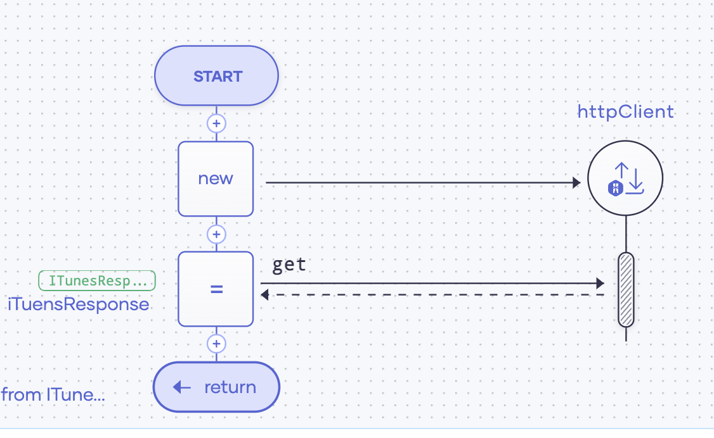

# Music Store as HTTP Service

## Scenario

This is a simple HTTP service written in Ballerina, which connects to 3rd party endpoint and returns results. 




## Sample Requests

### Get music tunes

**Request:**
```shell
curl "localhost:9090/store/tunes?name=hello"
```

**Response:**
```json
[
  {
    "artist": "Walk Off the Earth",
    "collection": "Hello - Single",
    "track": "Hello",
    "price": 0.99,
    "time": 293
  },
  {
    "artist": "Glee Cast",
    "collection": "Glee: The Music, Vol. 3 - Showstoppers (Deluxe Edition)",
    "track": "Hello (Glee Cast Version) [feat. Jonathan Groff]",
    "price": 13.99,
    "time": 205
  },
  {
    "artist": "Beyoncé",
    "collection": "I Am... Sasha Fierce (Deluxe Version)",
    "track": "Hello",
    "price": 13.99,
    "time": 256
  },
  {
    "artist": "Pop Smoke",
    "collection": "Shoot For The Stars Aim For The Moon (Deluxe)",
    "track": "Hello (feat. A Boogie wit da Hoodie)",
    "price": 19.99,
    "time": 190
  }
]
```

## Get discounted music tunes

**Request:**
```shell
curl "localhost:9090/store/discounts?name=hello"
```

**Response:**
```json
[
  {
    "artist": "Glee Cast",
    "album": "Glee: The Music, Vol. 3 - Showstoppers (Deluxe Edition)|Hello (Glee Cast Version) [feat. Jonathan Groff]",
    "discountedPrice": 13.8501,
    "time": 205
  },
  {
    "artist": "Pop Smoke",
    "album": "Shoot For The Stars Aim For The Moon (Deluxe)|Hello (feat. A Boogie wit da Hoodie)",
    "discountedPrice": 19.7901,
    "time": 190
  }
  {
    "artist": "Walk Off the Earth",
    "album": "Hello - Single|Hello",
    "discountedPrice": 0.9801,
    "time": 293
  },
  {
    "artist": "Beyoncé",
    "album": "I Am... Sasha Fierce (Deluxe Version)|Hello",
    "discountedPrice": 13.8501,
    "time": 256
  }
]
```

## Get customer list

**Request:**

```shell
curl "localhost:9090/store/customers"
```

***Response:**

```json
[
  {
    "id": 1,
    "name": "John",
    "address": "20, Palm Grove",
    "email": "john@foo.com"
  },
  {
    "id": 2,
    "name": "Peter",
    "address": "Palm Grove",
    "email": "peter@bar.com"
  }
]
```

## Add customer 

**Request:**

```shell
curl -X 'POST' \
'http://localhost:9090/store/customers' \
-H 'accept: application/json' \
-H 'Content-Type: application/json' \
-d '{
"id": 3,
"name": "Anne",
"address": "30, Pipe Drive",
"email": "anne@gmail.com"
}'
```

***Response:**

```json
{"id":3, "name":"Anne", "address":"30, Pipe Drive", "email":"anne@gmail.com"}
```