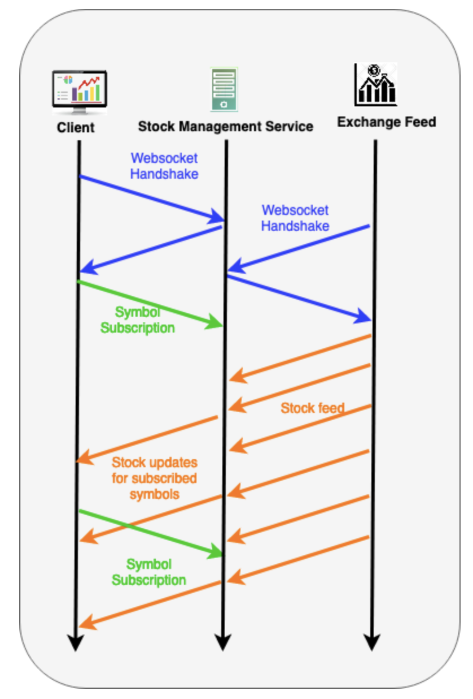

# Sample Use case

The WebSocket-based stock management server is getting stock data feed via WebSocket-based connections from different exchanges. The client applications will subscribe to the preferred stock symbols by registering those symbols with the stock management server. 

When the stock management server receives updates to the subscribed symbols, it will broadcast the data to the subscribed clients using a WebSocket connection.

## Running the applications

Let's run the three applications using the below commands in the following order.

`bal run ws_stock_mgt_server.bal. `

`bal run client.bal`

`bal run exchange.bal`
